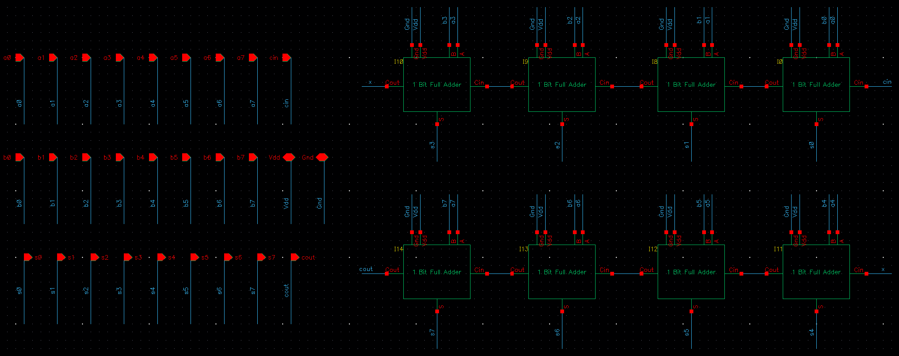
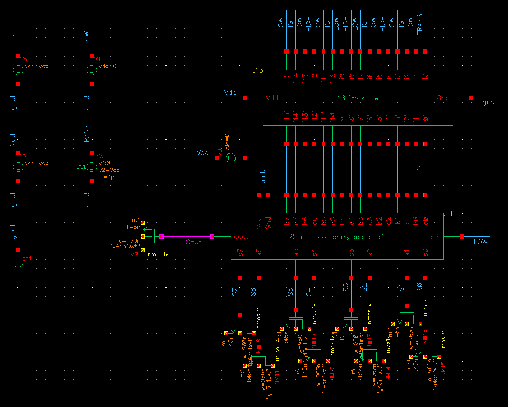
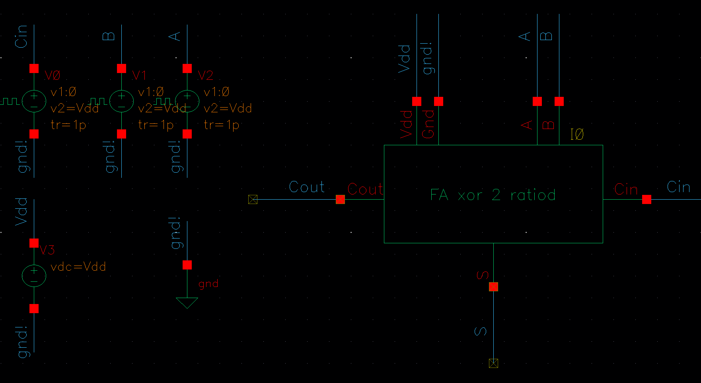

# University of Pennsylvania  

## Department of Electrical and System Engineering  

## Digital Integrated Circuits AND VLSI Fundamentals 

## ESE 5700, Fall 2024 (lets add a title page ~s) okiiii :) 

### Group members: Shreyaans Singh – 42835021, Ananya “Anna” Murali Kashyap – 40590283 ESE5700 Project 1: Optimization of Adder.

------
------

# 1. Baseline Design

## 1.1 Baseline Design Description, Schematics, and Test Schematics

### Description

The baseline design is centered around implementing a full adder circuit using complementary static CMOS technology. The design adheres to fundamental logic equations for sum and carry outputs, specifically:

Carry-out Boolean Function = \( C_{out} = A \cdot B + B \cdot C_{in} + A \cdot C_{in} \)

Sum Boolean Function = \( S = A \cdot B \cdot C_{in} + \overline{C_{out}} \cdot (A + B + C_{in}) \)

### Overview

The full adder circuit consists of interconnected logic gates that collectively compute the sum (\( S \)) and carry-out (\( C_{out} \)) signals. The schematic highlights the use of CMOS logic to create robust pull-up and pull-down networks that ensure reliable logic transitions. The Full Adder circuit utilizes 28 transistors in total.

### Design Features

1. **Inverter Optimization**: To reduce the number of logic stages in the carry path, the design leverages the inverting property. This helps minimize delays by sharing common inverting nodes and strategically placing inverters where necessary.

2. **PMOS and NMOS Stacking**: The layout incorporates tall PMOS stacks for both carry and sum generation circuits, which impacts capacitance and delay. The circuit uses 28 transistors to achieve this full adder configuration. The NMOS and PMOS transistors are arranged strategically along the critical path.

3. **Placement of Inputs**: The carry-generation circuit design, while slow, uses optimization techniques to reduce delays. By placing the control signal \( C_{in} \) on a smaller PMOS stack and positioning transistors close to the output, the design minimizes logical effort and delay. Pre-charging or discharging internal node capacitances in advance allows only a single node to be charged or discharged when \( C_{in, k} \) arrives, enhancing the circuit's efficiency.

1-bit Full adder Schematic  
All transistors are min sized: (W/L)n,p = (120 nm/45 nm)

1-bit Full adder Test Schematic

### 1-bit Full Adder Verification

- **Cin** is connected to a Vpulse with:
  - Period = 8 ns
  - Pulse width = 4 ns
  - \( V_1 = 0 \, V \)
  - \( V_2 = V_{dd} \)

- **B** is connected to a Vpulse with:
  - Period = 16 ns
  - Pulse width = 8 ns
  - \( V_1 = 0 \, V \)
  - \( V_2 = V_{dd} \)

- **A** is connected to a Vpulse with:
  - Period = 32 ns
  - Pulse width = 16 ns
  - \( V_1 = 0 \, V \)
  - \( V_2 = V_{dd} \)

- **Rise time** and **Fall time** = 1 ps, **delay** = 0 s

  - Additional details about Vpulse

- **\( V_{dd} \)** = Vdc = 1.1 V

### Truth Table for 1-bit Full Adder

| A | B | Cin | Sum | Cout |
|---|---|------|-----|-------|
| 0 | 0 | 0    | 0   | 0     |
| 0 | 0 | 1    | 1   | 0     |
| 0 | 1 | 0    | 1   | 0     |
| 0 | 1 | 1    | 0   | 1     |
| 1 | 0 | 0    | 1   | 0     |
| 1 | 0 | 1    | 0   | 1     |
| 1 | 1 | 0    | 0   | 1     |
| 1 | 1 | 1    | 1   | 1     |

Transient analysis of FA adder verification for 32n

Red = Input A, Green = Input B, Purple = Input Cin, Light Blue = Output Cout, Violet = Output S

The transient curve can be seen and mapped to the truth table and verified.

### Output: Verification of 1-bit Full Adder

Analyzing the Timing Diagram for a 1-bit Full Adder Logical Correctness

#### Taking 1 case for verification:

- **Inputs:** A = 1, B = 0, Cin = 1

- **Sum Calculation (S):** For a 1-bit full adder, the sum output is determined using the equation:

  \[
  S = A \cdot B \cdot C_{in} + \overline{C_{out}} \cdot (A + B + C_{in})
  \]

  Simplified as:

  \[
  S = A \oplus B \oplus C_{in}
  \]

- **Carry-out (Cout):** The carry-out is given by:

  \[
  C_{out} = A \cdot B + B \cdot C_{in} + A \cdot C_{in}
  \]

- **Waveform Verification:** In the timing diagram, during the time interval when A = 1, B = 0, and Cin = 1, the output sum \( S \) is 0, and the carry-out \( C_{out} \) is 1, which matches the expected result.

8-bit ripple carry adder schematic

### 8-bit Ripple Carry Adder

To construct an 8-bit ripple carry adder, we connected eight 1-bit full adder circuits in series. The configuration begins with the first full adder receiving **Cin = 0**, along with the input bits **A0** and **B0**. This initial stage produces the sum **S0** and a carry-out (**Cout1**). 

The carry-out of each preceding full adder is then connected to the carry-in of the subsequent full adder to propagate the carry signal through the chain. The last carry-out, **Cout**, serves as the overall carry output of the 8-bit adder, while the individual sums from **S0** to **S7** represent the 8-bit sum output.

This cascading structure forms the complete ripple carry adder, capable of adding two 8-bit binary numbers and generating a sum (**S0 – S7**) and carry-out, resulting in a 9-bit output.

----

## 1.2 Verification of 8bit baseline adder for logical correctness 

Test Schematic of 8-bit baseline to check for logical correctness

8-bit ripple carry adder verification graph (Transient Analysis 32n)

### Explanation

All 16 inputs, **A0** to **A7** and **B0** to **B7**, are toggled, with **Cin** set to 0 (always set to 0). 

- When all the inputs are 0, the outputs **S0** to **S7** and **Cout** remain 0, as seen in the transient analysis graph below.
- Conversely, when all inputs are 1, **S0** is 0 due to the initial **Cin** being 0. This only propagates a carry **Cout0 = 1** (carry-out of the first full adder). 
- For consequent stages, all three inputs are 1, resulting in the final **Cout** being 1, while all other 7 outputs, **S1** to **S7**, are set to 1.

## 1.3 Delay test case description and measurement

8-bit Ripple Carry Adder Delay Test Schematic

Input Drive Inverter Schematic

16 input inverter driver schematic

### Load Design

The maximum load of the 28-transistor Full Adder is **8Cg** (for inputs **A** and **B**). To simulate a load of **8Cg**, an NMOS transistor with a width **W = 960 nm** (calculated as 120 nm * 8 = 960 nm) and a length **L = 45 nm** is added. This NMOS configuration was applied to each sum output from **S0** to **S7**, with one NMOS transistor connected to each output. This setup helps emulate realistic self-loading conditions for evaluating the performance of the 8-bit ripple carry adder.

### Test Setup

The input configuration to the 8-bit ripple carry adder for the delay test is as follows:

- **A0** is switched, **A1**, **A2**, **A3**, **A4**, **A5**, **A6**, **A7** = LOW = **vdc = 0V**
  
- **B0**, **B1**, **B2**, **B3**, **B4**, **B5**, **B6**, **B7** = HIGH = **vdc = 1.1V**

  *(These inputs arrive through the load inverters which provide a realistic input.)*

This input configuration tests for the worst-case delay, as it ensures that the carry signal must propagate through all stages of the 8-bit ripple carry adder.

### Delay Measurement (Transient Analysis 60n)

- Delay is measured between **IN** and **Cout**.
  
- **Input** = Red

- **Cout** = Green

Transient Curve of input A0 switching and subsequently the output Cout  switching.  

Delay measurement from transient curve

| Parameter        | Calculation                        | Result     |
|------------------|------------------------------------|------------|
| \( \tau_{plh} \) | 20.34269 ns - 20.01335 ns          | 329.19 ps  |
| \( \tau_{phl} \) | 24.36127 ns - 24.00896 ns          | 352.32 ps  |
| \( \tau_p \)     | \( \frac{\tau_{plh} + \tau_{phl}}{2} \) | 340.83 ps |

----

## 1.4 Baseline maximum and average active energy measurements

- To evaluate the active energy consumption of the 8-bit ripple carry adder during addition operations, measurements were set up for two specific scenarios:

  - **Maximum Switching Energy Case**: This scenario involves measuring the energy when all inputs transition from 0 to 1 simultaneously (noted as TRANS in the test schematic). This case represents the highest possible energy consumption due to the simultaneous switching of all input bits, resulting in maximum capacitive charging and discharging through the adder circuit.

  - **Average Switching Energy Case**: This scenario measures the energy when only half of the inputs transition from 0 to 1. It simulates a more typical operation where only a portion of the bits switch, representing an average use case.

- For both cases, the switching energy is calculated by integrating the power drawn from the power supply over time, starting from the moment the inputs begin switching until the outputs have fully transitioned. This integration captures the energy consumed during the dynamic operation of the adder as it processes the input changes and generates the output results.

Maximum energy test schematic for 8-bit ripple carry adder

Maximum energy plot (Shows the Input, Output (Cout), Current at Vdd)

Maximum energy calculation (absolute and integrating)

The current is integrated from the point when all inputs start switching from 0 to when all outputs stop switching at 1.

Maximum active energy: **17.08 fJ**

Average energy test schematic for 8-bit ripple carry adder

Average energy plot (Shows the Input, Output (Cout), Current at Vdd)

Average energy calculation (absolute and integrating)

The current is integrated from the point when all inputs start switching from 0 to when all outputs stop switching at 1.

Average active energy: **10.27 fJ**

----

## 1.5 Baseline Leakage energy max/min cases and measurements

For the leakage energy analysis of the 8-bit ripple carry adder, we considered eight key input test cases involving different configurations of **A**, **B**, and **Cin** as mentioned in the truth table. The integration for measuring the leakage energy was conducted over **340.83 ps**, matching the delay period of the 8-bit adder to capture steady-state leakage when no switching occurred. 

Transient response plots confirmed steady current behavior during these periods and showed energy spikes during active switching, allowing us to thoroughly assess the adder’s energy profile under different input conditions.

Leakage energy test schematic

Leakage energy plot

Leakage energy calculation

### Leakage Energy Table for All Inputs

| Input Case | Energy over \( \tau_p \) | Energy for 8-bit RC Adder |
|------------|---------------------------|----------------------------|
| 000        | 4.534 fJ                  | 36.272 fJ                 |
| 001        | 5.203 fJ                  | 41.624 fJ                 |
| 010        | 3.664 fJ                  | **29.312 fJ** (Minimum)   |
| 011        | 4.319 fJ                  | 34.552 fJ                 |
| 100        | 4.76 fJ                   | 38.08 fJ                  |
| 101        | 3.741 fJ                  | 29.928 fJ                 |
| 110        | 3.709 fJ                  | 29.672 fJ                 |
| 111        | 8.498 fJ                  | **67.984 fJ** (Maximum)   |

- **Minimum leakage energy** for input case **010**: 29.312 fJ
- **Maximum leakage energy** for input case **111**: 67.984 fJ

# 2. Optimized Design and Methodology

## 2.0 Topological Considerations

For optimizing the 8-bit Ripple Carry Adder, we took two new topologies into consideration:

- Ratio’d XOR2-NAND2 implementation
- Mirror Full Adder

In the next section, we will describe why we chose one design over the other.

** *Note we have carried out active and leakage energy calculations only for 1 design which we felt was better. As one of the design have a lower delay but doesn't restore the output.* **

## 2.1 Optimized Design Description, Schematics, and Test Schematics

**Ratiod Full Adder:**

### Description

Topology Diagram

Using the above topology, we can see that the sum of the full adder is generated by using 2 XOR2 gates in a chain topology. This simply implements the Boolean function:

\[
S = A \oplus B \oplus C_{in}
\]

Further, in the topology, the carry output is obtained by utilizing 3 NAND2 gates in a tree topology.

Where:
\[
X = A \oplus B
\]

Thus:
\[
C_{out} = \overline{\left(\overline{\left((A \oplus B) \cdot C_{in}\right)} \cdot \overline{(A \cdot B)}\right)}
\]

which simplifies to:
\[
C_{out} = A \cdot B + A \cdot C_{in} + B \cdot C_{in}
\]

In this topology, each XOR2 gate uses 12 transistors (4 for 2 inverters and 8 for XOR2 implementation), and each ratio’d NAND2 gate uses 3 transistors (with a Pull-down Logic function). 

In total, the topology has \(12 \times 2 + 3 \times 3 = 33\) transistors (15 PMOS, 18 NMOS).

The critical path (path propagating the carry-out) is the tree topology of the three NAND2 gates. Therefore, we decided to use ratio’d logic to decrease the delay.

### Schematics

### Test Schematics
